# CO₂ Emissions

Приложение для отображения и анализа данных по выбросам CO₂ по странам с возможностью поиска, сортировки, выбора года и добавления дополнительных колонок.

## 🚀 Initial Profiling (до оптимизаций)

Для анализа производительности был использован **React Dev Tools Profiler**.  
Измерения проводились во время следующих действий:

- сортировка колонки;
- поиск страны;
- выбор другого года;
- добавление/удаление колонок.

### 🔎 Результаты профилинга

- **Commit Duration:** ~0.9-2.4 s
- **Render Duration:** до 62ms на отдельные компоненты
- **Interactions:** поиск вызывал ререндер компонента Headers
- **Flame Graph:** желтые зоны у `CountryInfo`
- **Ranked Chart:** в топе по времени рендера был:
    - `CountryInfo`

📸 Скриншоты из Profiler (до оптимизаций):  
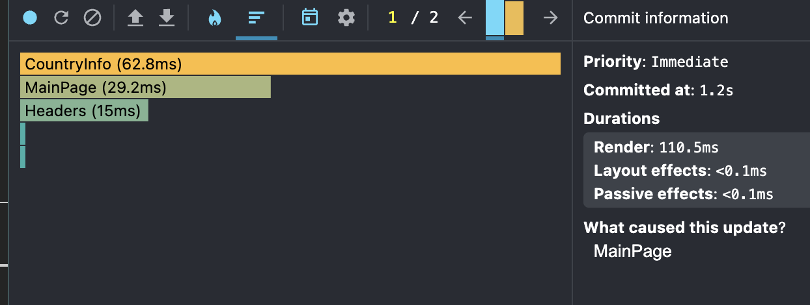  
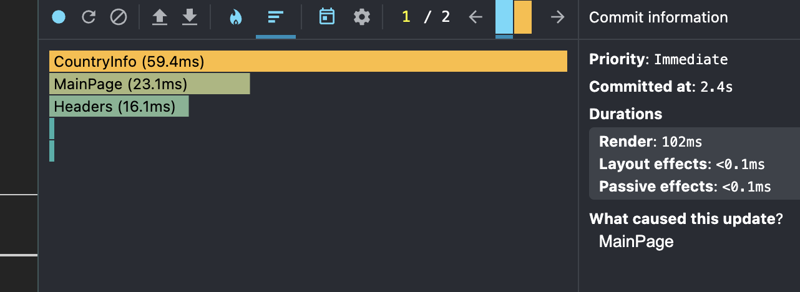  
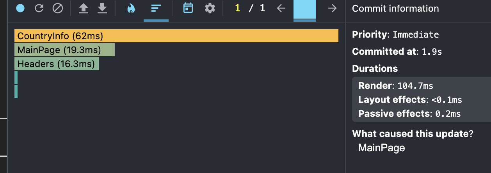  
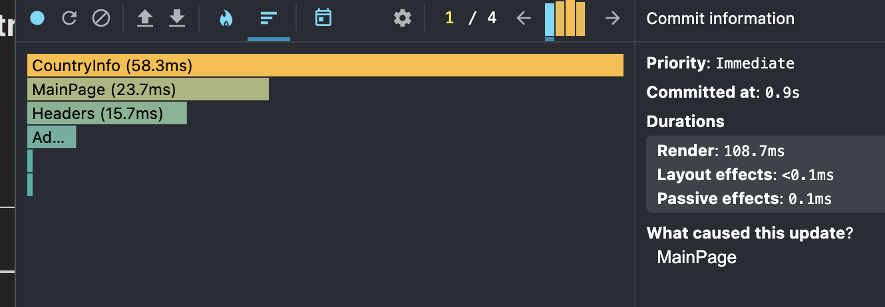  
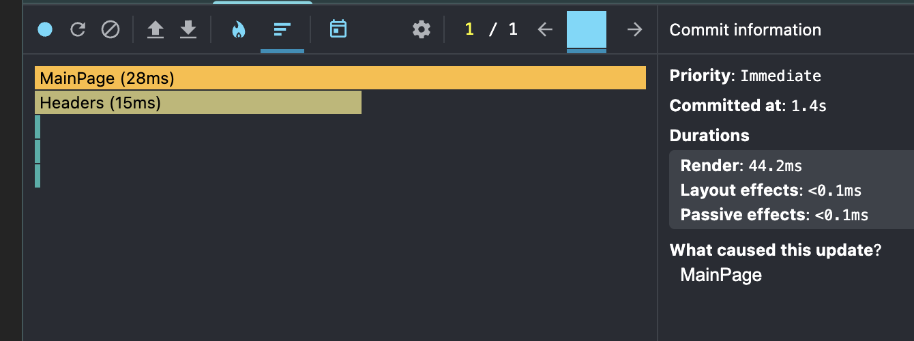
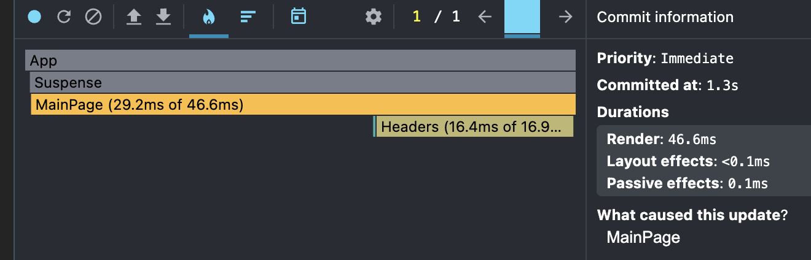

---

## ⚡ Optimization with React.memo & useMemo

Для уменьшения ненужных перерисовок были применены оптимизации:

- `React.memo` для компонент:
    - `CountryInfo`
    - `Headers`
    - `SearchBar`
- `useMemo` для мемоизации вычисляемых данных:
    - список лет;
    - список стран по выбранному году;
    - фильтрация и сортировка;
- `useCallback` для функций-обработчиков.

### 🔎 Результаты повторного профилинга

- **Commit Duration for Search interaction:** уменьшилось до 1.2 s
- **Render Duration:** `Headers` больше не рендерится при поиске, поиск не должен влиять на заголовки колонок
- **Interactions:** число компонентов, реагирующих на действия, уменьшилось
- **Ranked Chart:** `CountryInfo` так и остался в топе по времени рендера, как я понимаю

📸 Скриншоты из Profiler (после оптимизаций):  
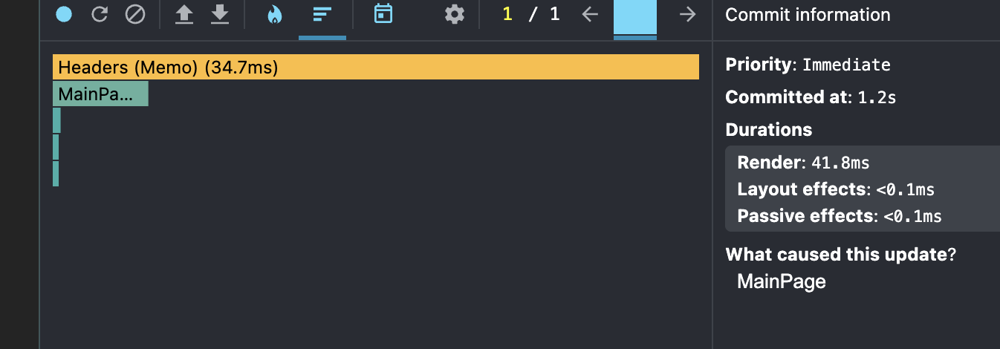  
  
  
  
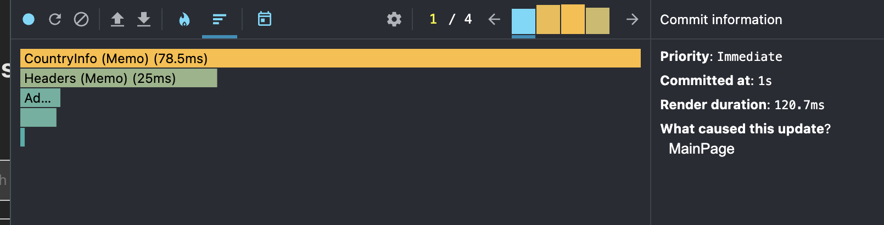  
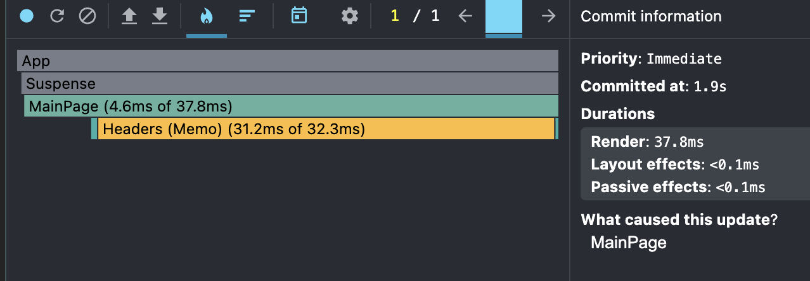  

---

## 📊 Сравнение до и после оптимизаций

| Параметр                                | До оптимизации            | После оптимизации             |
|-----------------------------------------|---------------------------|-------------------------------|
| Commit Duration for search interactions | 1.4 s                     | 1.2s                          |
| Flame Graph                             | Желтые зоны               | Желтые зоны                   |
| Ranked Chart                            | CountryInfo на 1 месте    | CountryInfo на 1 месте        |
| Ranked Chart                            | Headers перерендеривается | Headers не перерендеривается  |
| Ranked Chart                            | Ненужный ререндер         | Меньше компонентов рендерится |

Применение `React.memo`, `useMemo` и `useCallback` позволило:

- Уменьшить количество ненужных перерисовок.
- Улучшился перформанс для поиска

### 🔎 Важный момент

Если смотреть по времени  рендера через console.time и console.timeEnd - видим, что время уменьшается в разы.
Вот скрин до:

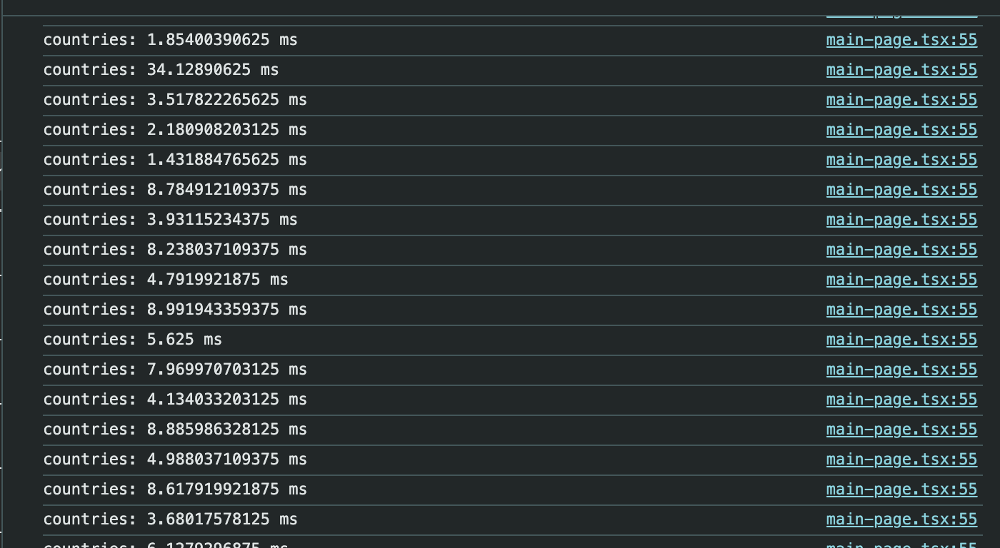

После:

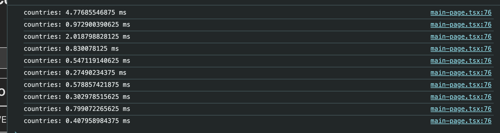

Не смогла увидеть этого в профайлере, но здесь это четко видно) видимо все-таки оптимизация сработала.

